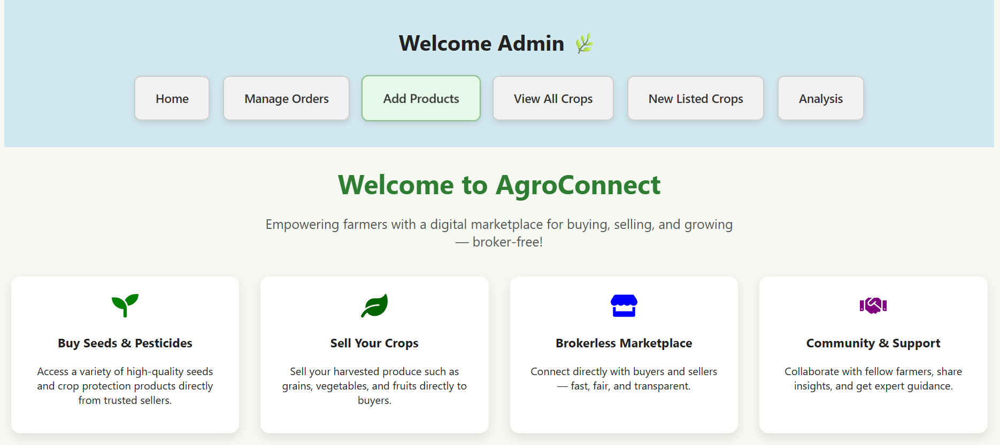
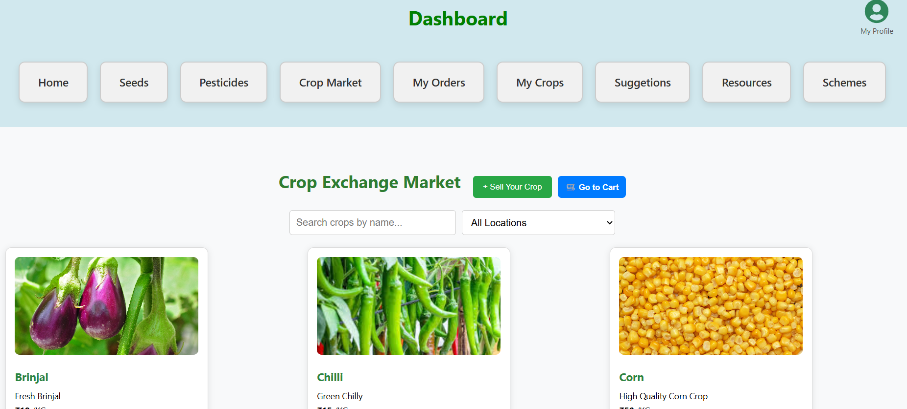

# AgroConnect
# 🌾 AgroConnect - Smart Agriculture Assistance Platform

AgroConnect is a full-stack web application designed to bridge the gap between **farmers** and **agricultural officers (AEOs)** by providing tools for crop diagnosis, pesticide suggestions, agricultural learning resources, and real-time access to government schemes.

---

## 🚀 Features

### 👩‍🌾 Farmer Module
- ✅ Register/Login with role-based access
- 📸 Submit infected crop leaf images for diagnosis
- 💬 Receive pesticide suggestions from officers
- 🛒 Buy & Sell crops, seeds, and pesticides
- 📚 Access PDF guides, YouTube tutorials, and video resources
- 🏛️ View active government schemes and updates

### 🧑‍🌾 Agriculture Executive Officer (AEO) Module
- 🔐 Secure AEO login with checkbox verification
- 🧪 View and respond to diagnosis requests from farmers
- 📤 Upload learning materials (PDF/Video/YouTube)
- 📢 Post government schemes with state-based filtering

---

## 🛠️ Tech Stack

| Frontend       | Backend        | Database |
|----------------|----------------|----------|
| React.js       | Node.js + Express.js | MongoDB  |

- File Upload: `Multer`
- Authentication: `JWT`, `bcrypt`
- UI Styling: CSS
- Deployment: Manual (local)

---

## 🖥️ Screenshots

| Farmer Dashboard | Officer Dashboard |
|------------------|-------------------|
|  |  |

---

## 🔒 Role-Based Access

- 👨‍🌾 **Farmer:** Can view/post requests and use marketplace
- 🧑‍⚖️ **AEO:** Can review requests and upload resources
- Admin-level privileges can be extended for future scalability

---

## 📁 Project Structure

AgroConnect/
├── client/ # React frontend
├── server/ # Express backend
│ ├── models/ # MongoDB Schemas
│ ├── routes/ # API routes
│ └── uploads/ # Image/PDF/Video files
├── .env
└── README.md

# ✅ How to Run Locally

### 1. Clone the Repository

git clone https://github.com/your-username/agroconnect.git
cd agroconnect
2. Install Dependencies
For frontend:

cd client
npm install
npm start
For backend:

cd server
npm install
npm start
3. Environment Variables
Create a .env file in the server/ directory:

MONGO_URI=your_mongodb_connection_string
JWT_SECRET=your_jwt_secret_key

 #to send the emails
EMAIL_USER=your_emai_address
EMAIL_PASS=your app password

📚 Future Enhancements
Real-time chat between farmer and officer

Weather API integration

Mobile App (React Native or Flutter)

Admin analytics dashboard

SMS/email notifications for updates

🤝 Contributing
Pull requests are welcome. For major changes, please open an issue first to discuss what you would like to change.

📄 License
This project is open-source and free to use for educational and non-commercial purposes.
